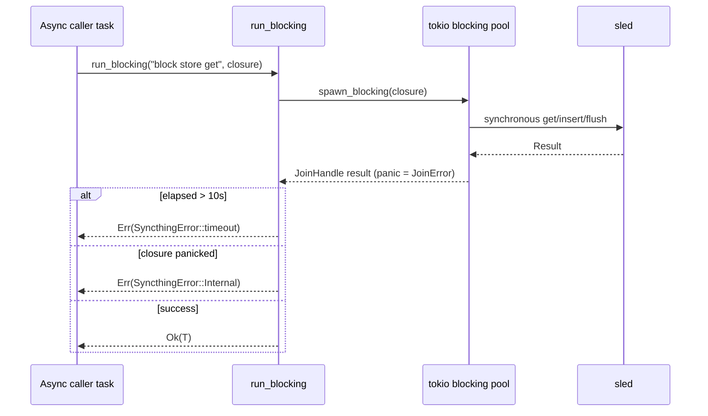

# Sequence: sled 阻塞 I/O 派发（run_blocking）

被引用自：`docs/design/ADR-20261105-db-blocking-io.md`。

```mermaid
sequenceDiagram
    participant T as Async caller task
    participant RB as run_blocking
    participant BP as tokio blocking pool
    participant S as sled
    T->>RB: run_blocking("block store get", closure)
    RB->>BP: spawn_blocking(closure)
    BP->>S: synchronous get/insert/flush
    S-->>BP: Result
    BP-->>RB: JoinHandle result (panic = JoinError)
    alt elapsed > 10s
        RB-->>T: Err(SyncthingError::timeout)
    else closure panicked
        RB-->>T: Err(SyncthingError::Internal)
    else success
        RB-->>T: Ok(T)
    end
```
