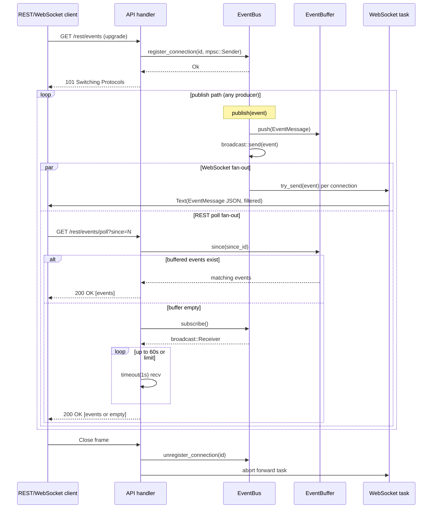

# Sequence: 事件投递（WebSocket + REST long-poll）

被引用自：`docs/design/ADR-20261105-event-delivery.md`。

```mermaid
sequenceDiagram
    participant C as REST/WebSocket client
    participant H as API handler
    participant B as EventBus
    participant Buf as EventBuffer
    participant Ws as WebSocket task
    C->>H: GET /rest/events (upgrade)
    H->>B: register_connection(id, mpsc::Sender)
    B-->>H: Ok
    H-->>C: 101 Switching Protocols
    loop publish path (any producer)
        Note over B: publish(event)
        B->>Buf: push(EventMessage)
        B->>B: broadcast::send(event)
        par WebSocket fan-out
            B->>Ws: try_send(event) per connection
            Ws->>C: Text(EventMessage JSON, filtered)
        and REST poll fan-out
            C->>H: GET /rest/events/poll?since=N
            H->>Buf: since(since_id)
            alt buffered events exist
                Buf-->>H: matching events
                H-->>C: 200 OK [events]
            else buffer empty
                H->>B: subscribe()
                B-->>H: broadcast::Receiver
                loop up to 60s or limit
                    H->>H: timeout(1s) recv
                end
                H-->>C: 200 OK [events or empty]
            end
        end
    end
    C->>H: Close frame
    H->>B: unregister_connection(id)
    H->>Ws: abort forward task
```
